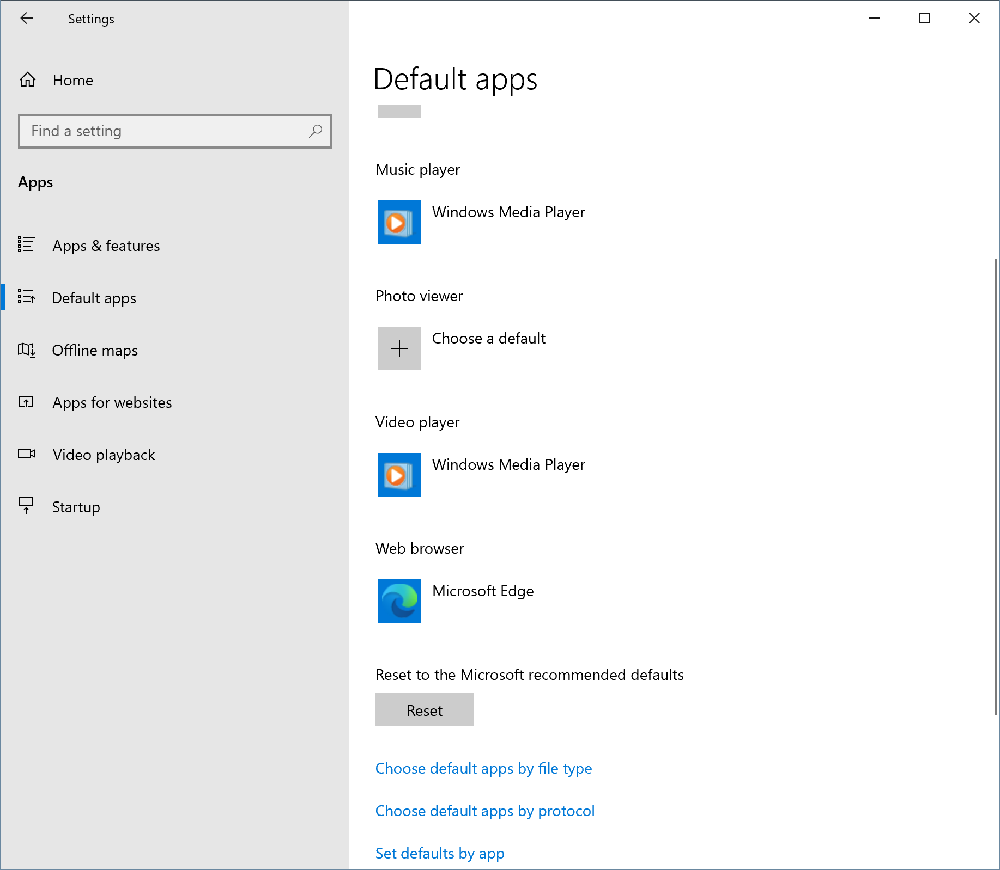
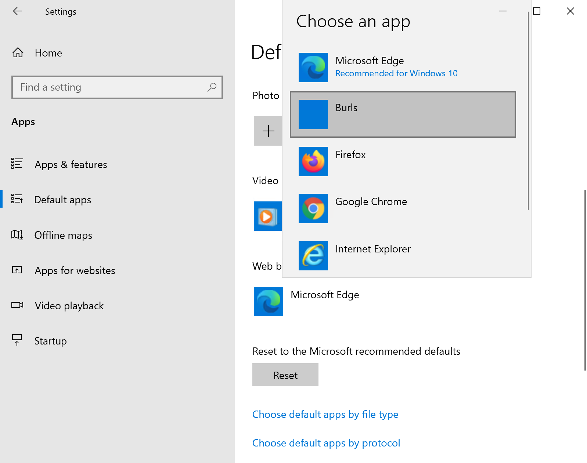
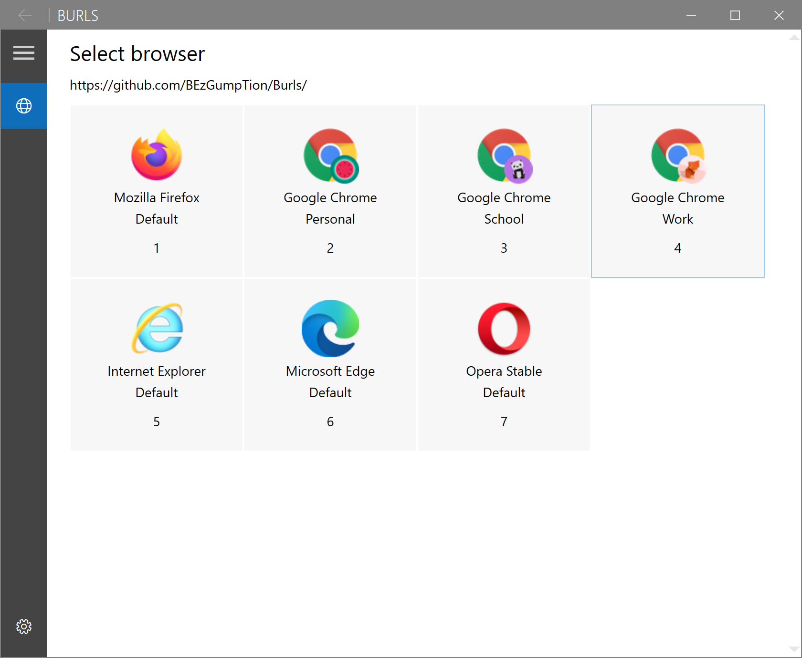

# Burls - Installation
## Guide
1. Download and install [.NET Core 3.1](https://dotnet.microsoft.com/download/dotnet-core/current/runtime).
1. Download and install [the latest version of Burls](https://github.com/BEzGumpTion/Burls/releases) from the releases section.
1. Navigate in Windows 10 to 'Settings', 'Apps', 'Default apps'.

1. Click on 'Web browser' and select 'Burls'.

1. Close the settings.
1. Everything is now set to use Burls!
